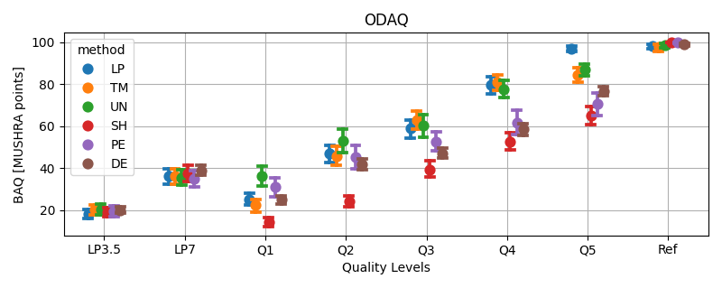

# ODAQ: Open Dataset of Audio Quality

[id]:https://arxiv.org/abs/2401.00197

ODAQ is a dataset addressing the scarcity of openly available collections of audio signals accompanied by corresponding subjective scores of perceived quality.

ODAQ contains 240 audio samples accompanied by corresponding quality scores obtained via a MUSHRA listening test carried out in parallel at Fraunhofer IIS (Germany) and at Netflix, Inc. (USA).

The quality-rated audio samples are processed versions of the original audio material (also made available). The original audio material consists of:
- stereo audio with 44.1 or 48 kHz sampling frequency;
- 14 music excerpts (8 of which are solo recordings);
- 11 excerpts from movie-like soundtracks with dialogues mixed with music and effects (separate stems and transcripts are also provided).

## Download
- ODAQ can be downloaded from Zenodo: https://doi.org/10.5281/zenodo.10405774
- Further subjective test scores on the same audio files can be downloaded from: https://doi.org/10.5281/zenodo.13377284

## Highlights

- Each of the 240 audio samples is rated by 26 expert listeners (after post-screening).
- The audio samples are processed by a total of 6 method classes, each operating at 5 different quality levels, plus anchor conditions.
- The audio samples are processed by methods designed to generate quality degradations possibly encountered during audio coding and source separation.
- The quality levels for each processing method span the entire quality range.  
- The diversity of the processing conditions, the large span of quality levels, the high sampling frequency of the audio signals, and the pool of international listeners make ODAQ particularly suited for further research into the prediction and analysis of perceived audio quality.
- The dataset is released with permissive licenses, and [the software used to conduct the listening test](https://github.com/Netflix-Skunkworks/listening-test-app) is also publicly available.


## ICASSP 2024

Please refer to [our ICASSP 2024 paper][id] for full details about the listening test and please cite it if you find this dataset useful:
```
@inproceedings{Torcoli2024ODAQ,
author = {Torcoli, M. and Wu, C. W. and Dick, S. and Williams, P. A. and Halimeh, M. M. and Wolcott, W. and Habets, E. A. P.},
year = {2024},
month = {April},
title = {{ODAQ}: Open Dataset of Audio Quality},
address = {Seoul, Korea},
booktitle={IEEE International Conference on Acoustics Speech and Signal Processing (ICASSP)}
}
```

##  At a Glance

The ODAQ package contains the raw results from the listening test. The results for each participant are stored as `.xml` files as output by [the listening test app.](https://github.com/Netflix-Skunkworks/listening-test-app)
For convenience, the raw results are also aggregated in `ODAQ_results.csv` so that they can be easily loaded, e.g., in python by pandas:

```python
import pandas

ODAQ_results=pandas.read_csv('./ODAQ/ODAQ_listening_test/ODAQ_results.csv')
```

And then plot with seaborn:
```python
import seaborn
import matplotlib.pyplot as plt

seaborn.pointplot(data=ODAQ_results, x='condition', y='score', hue='method', linestyle='none', dodge=True, capsize=.1)
plt.grid()
plt.title('ODAQ')
plt.xlabel('Quality Levels')
plt.ylabel('BAQ [MUSHRA points]')
```

Returning an overview of the quality scores contained in the dataset:



In just a few lines of code, you were able to reproduce a slightly uglier version of [Fig. 2 in our paper][id].


## Call for Contributions

We make this data available to the community and we welcome contributions and extensions from the community!

### How to contribute? 

There are many ways to contribute to ODAQ (and we welcome all of them!). Here, we will provide examples of two main types of contributions:

#### Type 1: Extend with additional materials:

This type of contribution extends the dataset with materials such as new audio content and/or new subjective scores. Please refer to [./extend/](./extend/) subfolder for more information. 

#### Type 2: Benchmark with the existing dataset: 

This type of contribution utilizes the dataset for benchmarking and provides the results in a reproducible manner. Please refer to [./benchmark/](./benchmark/) subfolder for more information.
