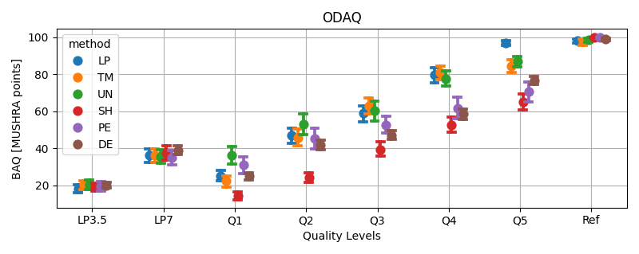

# ODAQ: Open Dataset of Audio Quality


## Latest News
- 2026.01: new contribution to ODAQ is available. For a complete list of contributions, see the [Data Contributions](#data-contributions--odaq-collection) and [Result Contributions](#result-contributions) tables below.

## Introduction

ODAQ (Open Dataset of Audio Quality) is a growing collection of openly available audio datasets accompanied by corresponding subjective quality scores. The collection addresses the scarcity of such resources for research into the prediction and analysis of perceived audio quality.

All ODAQ datasets (Basic-set) are created using the MUSHRA listening test methodology, conducted by expert listeners from international laboratories including Fraunhofer IIS (Germany), Netflix, Inc. (USA), and Ball State University (USA). The audio material consists of stereo signals sampled at 44.1 or 48 kHz, including music excerpts (solo recordings and ensemble pieces) as well as movie-like soundtracks with dialogues mixed with music and effects.

Key characteristics of ODAQ:
- **Diverse processing conditions**: Audio samples processed by various method classes designed to generate quality degradations encountered during audio coding and source separation
- **Full quality range coverage**: Quality levels for each processing method span the entire quality range
- **High-fidelity audio**: Stereo audio with 44.1 or 48 kHz sampling frequency
- **International expert listeners**: Ratings from trained listeners across multiple laboratories
- **Permissive licensing**: All content released under Creative Commons licenses
- **Open tools**: The [listening test app](https://github.com/Netflix-Skunkworks/listening-test-app) used to conduct the tests is publicly available

### Data Contributions — ODAQ-Collection

The **ODAQ-Collection** is the unified dataset containing multiple subsets. You can download the complete collection ([Zenodo](TBD)) or individual subsets from the table below. The collection organizes subsets as subfolders named by their identifier (e.g., `2024-icassp/`, `2024-aes/`, `2025-aes/`).

| Identifier | Paper | Audio | Scores | Test Type | Listeners | Notes |
|:----------:|:------|:-----:|:------:|:---------:|:---------:|:------|
| **Basic-set** | | | | | | |
| [2024-icassp](https://doi.org/10.5281/zenodo.10405774) | [ODAQ: Open Dataset of Audio Quality](https://arxiv.org/abs/2401.00197) | Yes | Yes | Lab MUSHRA | Expert | Initial release; 240 samples; 6 methods (LP, PE, SH, TM, UN, DE); 26 listeners |
| [2024-aes](https://doi.org/10.5281/zenodo.13377284) | [Expanding and Analyzing ODAQ](https://arxiv.org/abs/2504.00742) | No | Yes | Lab MUSHRA | Expert | +16 trained university listeners; benchmark analysis of objective metrics |
| [2025-aes](https://doi.org/10.5281/zenodo.17162670) | [Investigating the impact of stereo processing](https://arxiv.org/abs/2512.14259) | Yes | Yes | Lab MUSHRA | Expert | LR/MS stereo processing extension; 176 samples; 6 methods (QNLR, QNMS, QNmix, SHLR, SHMS, SHmix); 16 listeners |
| **Community-extension** | | | | | | |
| [2025-lanzendorfer](https://doi.org/10.5281/zenodo.18184035) | [Evaluating Objective Speech Quality Metrics for Neural Audio Codecs](https://arxiv.org/abs/2511.19734) | Yes | Yes | Crowd-source MUSHRA | Self-reported expert | Derived from 2024-icassp speech items; two variants (speech, combined); 99 samples each; 11 / 17 listeners |

*Note: The identifiers above replace previously used version labels: `2024-icassp` was "ODAQ v1", `2024-aes` was "ODAQ v1-BSU", and `2025-aes` was "ODAQ v1.5". Going forward, we use year-based identifiers to avoid confusion.*

### Result Contributions

We encourage all contributions from the research community, including new results and learnings derived from ODAQ. For guidance on using ODAQ for benchmarking, refer to the [benchmark](./benchmark/) subfolder for examples and considerations. We previously relied on [Papers with Code](https://paperswithcode.com/dataset/odaq-open-dataset-of-audio-quality) for sharing results, but the platform has since been deprecated. We are actively looking for alternative ways to make it easier for the community to share their results. In the meantime, we maintain the following non-exhaustive list as a best effort to track progress and contributions from the community. Please contact us if you would like us to update the list.

| Venue/Year | Paper | Used For |
|:----------:|:------|:--------:|
| ICASSP 2025 | [Semi-intrusive Audio Evaluation](https://arxiv.org/abs/2409.14069) | Other |
| ICASSP 2025 | [On the Relation Between Speech Quality and Quantized Latent Representations of Neural Codecs](https://ieeexplore.ieee.org/document/10890357) | Benchmark |
| ICASSP 2025 | [OpenACE: An Open Benchmark for Evaluating Audio Coding Performance](https://ieeexplore.ieee.org/document/10889159) | Benchmark |
| ICASSP 2025 | [Audio Decoding by Inverse Problem Solving](https://ieeexplore.ieee.org/document/10888255) | Other |
| IEEE 2025 | [HAAQI-Net: A Non-Intrusive Neural Music Audio Quality Assessment Model for Hearing Aids](https://ieeexplore.ieee.org/document/10869478) | Benchmark |
| ITG 2025 | [Navigating PESQ: Up-to-Date Versions and Open Implementations](https://arxiv.org/abs/2505.19760) | Benchmark |
| AES 2025 | [Identification of Audio Coding Artifacts Generated Due to Bandwidth Extension Schemes](https://ieeexplore.ieee.org/document/11226558) | Other |
| AES 2025 | [Exploring Perceptual Audio Quality Measurement on Stereo Processing Using ODAQ](https://arxiv.org/abs/2512.10689) | Benchmark |
| arXiv 2025 | [Zimtohrli: An Efficient Psychoacoustic Audio Similarity Metric](https://arxiv.org/abs/2509.26133) | Training |
| arXiv 2025 | [DeePAQ: A Perceptual Audio Quality Metric Based On Foundational Models](https://arxiv.org/abs/2510.12326) | Benchmark |
| arXiv 2025 | [Evaluating Objective Speech Quality Metrics for Neural Audio Codecs](https://arxiv.org/abs/2511.19734) | Other |
| ICASSP 2026 | [Enhanced Generative Machine Listener (GMLv2)](https://arxiv.org/abs/2509.21463) | Benchmark |


## At a Glance

ODAQ is now a collection of multiple subsets (see [Data Contributions](#data-contributions--odaq-collection) above). For a quick look at the original set (`2024-icassp`), which contains 240 quality-rated audio samples across 6 processing methods, check out the [figures](./figures/) folder. It includes an overview figure of the subjective quality scores as well as example code for reproducing it.




## Call for Contributions

We make this data available to the community and we welcome contributions and extensions from the community!

### How to contribute? 

There are many ways to contribute to ODAQ (and we welcome all of them!). Here, we will provide examples of two main types of contributions:

#### Type 1: Extend with additional materials:

This type of contribution extends the dataset with materials such as new audio content and/or new subjective scores. Please refer to [./extend/](./extend/) subfolder for more information. 

#### Type 2: Benchmark with the existing dataset: 

This type of contribution utilizes the dataset for benchmarking and provides the results in a reproducible manner. Please refer to [./benchmark/](./benchmark/) subfolder for more information.


## How to Cite

If you use the original ODAQ dataset (`2024-icassp`), please cite:

```
@inproceedings{Torcoli2024ODAQ,
  author    = {Torcoli, M. and Wu, C. W. and Dick, S. and Williams, P. A. and Halimeh, M. M. and Wolcott, W. and Habets, E. A. P.},
  year      = {2024},
  month     = {April},
  title     = {{ODAQ}: Open Dataset of Audio Quality},
  address   = {Seoul, Korea},
  booktitle = {IEEE International Conference on Acoustics Speech and Signal Processing (ICASSP)}
}
```

For other subsets or contributions, please cite the corresponding paper as listed in the [Data Contributions](#data-contributions--odaq-collection) and [Result Contributions](#result-contributions) tables above.
